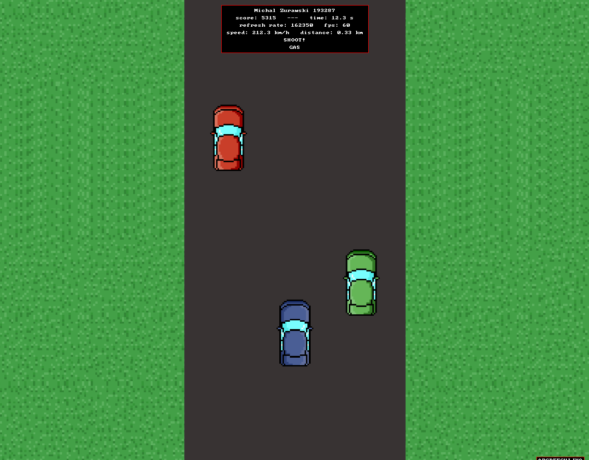
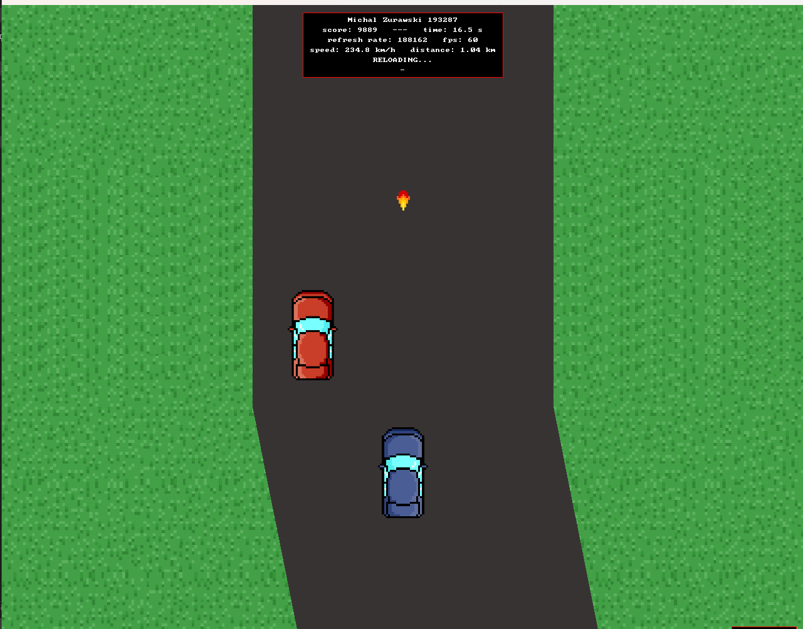
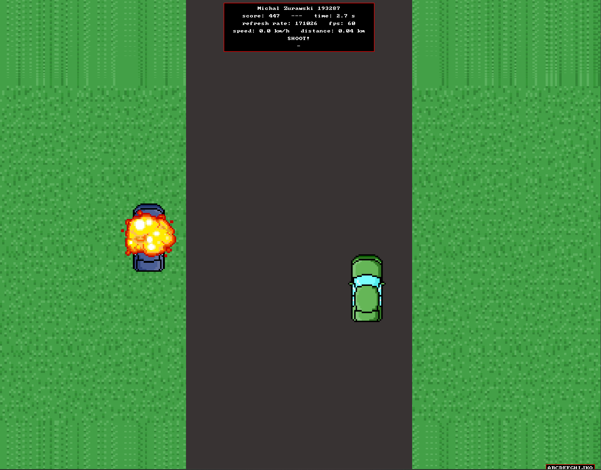
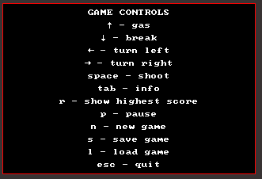

# SpyHunter

A simple **Spy Hunter–inspired** top‑down driving game built in **C++** using **SDL2**.  
Drive on a scrolling road, avoid going off-road, shoot enemies, and try to beat the highest score.

> This repo vendors **SDL2 2.0.10** under `SDL2-2.0.10/` and is set up primarily for **Windows / Visual Studio** builds.

---



---

## Features

- SDL2 window + software-surface rendering pipeline
- Procedural road turns (left / straight / right)
- Player movement:
  - accelerate / brake
  - steering left/right
  - off-road detection (penalties / death)
- Enemies + civilian cars
- Shooting (projectile + reload timer)
- Score system + persistent high score (`saves/score.txt`)
- Save/Load slots stored in `saves/saves.txt`
- In-game info/overlays (FPS, speed, distance, etc.)





---

## Project structure

- `main.cpp` — game loop, input handling, rendering, save/load, and gameplay logic
- `assets/` — `.bmp` sprites loaded at runtime (cars, explosions, grass, charset)
- `saves/` — save files and score persistence
- `SDL2-2.0.10/` — vendored SDL2 headers and libraries (used by the VS project)
- `szablon2vs17.sln` / `szablon2vs17.vcxproj` — Visual Studio solution/project files

---

## Requirements

### Windows (recommended)
- Visual Studio (project uses **PlatformToolset v141** in `szablon2vs17.vcxproj`)
  - VS 2017 recommended, or newer VS with v141 toolset installed
- SDL2 libs already referenced from the repo:
  - `SDL2-2.0.10/lib/x86/sdl2.lib`, `sdl2main.lib`
  - `SDL2-2.0.10/lib/x64/sdl2.lib`, `sdl2main.lib`

---

## Build & Run (Visual Studio)

1. Clone the repository:
   ```bash
   git clone https://github.com/mi-zuri/SpyHunter.git
   cd SpyHunter
   ```

2. Open **`szablon2vs17.sln`** in Visual Studio.

3. Select configuration:
   - `Debug` or `Release`
   - `x64` or `Win32`

4. Build and run (F5).

### Important: working directory / assets
The game loads bitmaps using relative paths like `./assets/<name>.bmp` and saves to `./saves/...`.

If you get missing asset/save errors, ensure your **working directory** is the repository root.
In Visual Studio you can set:
- **Project → Properties → Debugging → Working Directory** = `$(ProjectDir)`

---

## Controls



---

## Notes

- Window title is set to **"SpyHunter"** in `main.cpp`.
- The project currently uses a software surface (`SDL_Surface`) and copies it into a texture each frame.
- A large portion of SDL2 is vendored in this repository; see the SDL licensing information in `SDL2-2.0.10/`.

---

## License

No top-level project license file was found in the repository root.

SDL2 (vendored under `SDL2-2.0.10/`) is distributed under the **zlib license** (see the SDL2 sources for details).

If you want, tell me what license you want for *SpyHunter itself* (MIT/Apache-2.0/GPL/etc.) and I can draft a `LICENSE` file + update this README accordingly.
